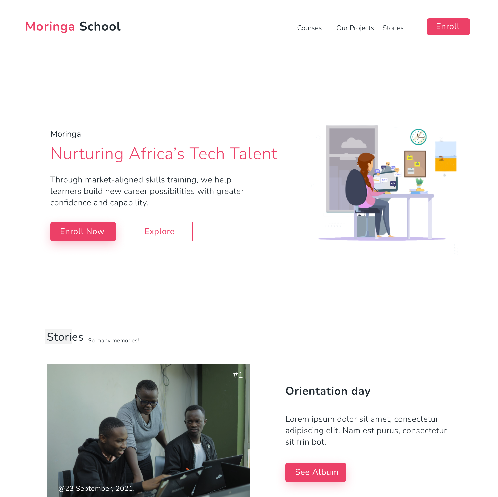

# Project Name
> Landing Page of a School Website
> Live demo [_here_](https://tim254.github.io/MSIP-01/). 

## Table of Contents
* [General Info](#general-information)
* [Technologies Used](#technologies-used)
* [Objectives](#objectives)
* [Screenshots](#screenshots)
* [Project Status](#project-status)
* [Room for Improvement](#room-for-improvement)
* [Acknowledgements](#acknowledgements)
* [Contact](#contact)

## General Information
- Reproducing the reproducing the landing page of a school website using pure HTML & CSS only.

## Technologies Used
- HTML
- CSS
- VSCODE

## Objectives

- Correct use of HTML Elements and tags 
- The page incorporates a custom-made stylesheet 
- Use of at least 4 of the following styling rules
- The web page is visually appealing
- The project design
- The page is published/deployed to gh-pages

## Screenshots

## Project Status
Project is complete.

## Room for Improvement

Room for improvement:
- The layout could have been a lot better.
- The website is not responsive.

## Acknowledgements
This project was not possible without the help of Moringa School Technical mentors as well as learning peers. Kudos.

## Contact
Created by [@Tim254](https://github.com/Tim254) - feel free to contact me through my [@email](tim.mailu@gmail.com)

